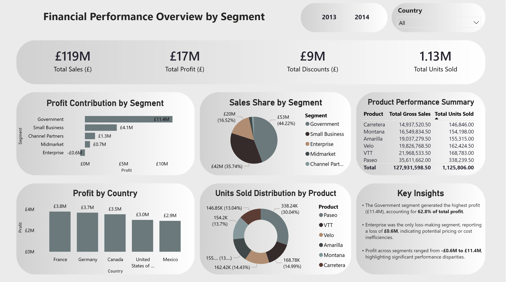

# Financial Performance Overview by Segment

This Power BI dashboard analyses financial performance across customer segments, products, and countries, focusing on sales, profit, discounts, and units sold.  
It provides a clear, comparative view of segment profitability and market contribution to support business decision-making.

# Preview

# Key Insights

- The **Government segment** generated the highest profit (£11.4M), accounting for **62.8% of total profit**.
- **Enterprise** was the only loss-making segment, reporting a loss of **£0.6M**, indicating potential pricing or cost inefficiencies.
- Profit across segments ranged from **-£0.6M to £11.4M**, highlighting significant performance disparities.
- **France and Germany** were the strongest markets by profit, while **Mexico** showed the lowest contribution.
- **Paseo** led product performance, achieving the highest revenue and units sold.

# Dashboard Overview

The dashboard includes:

- KPI summary cards:
  - Total Sales (£)
  - Total Profit (£)
  - Total Discounts (£)
  - Total Units Sold
- Profit contribution by customer segment
- Sales share by segment
- Profit by country
- Units sold distribution by product
- Product performance summary table
- Interactive slicers for **Year** and **Country**
- Integrated **Key Insights** panel for executive-level interpretation

# Tools and Techniques

- Power BI Desktop
- Data modelling
- DAX measures and aggregations
- Excel for raw data preparation
- Business-oriented dashboard design
- Insight-driven analytical storytelling

# Files in This Repository

- **Financial-Overview-Dashboard.pbix** – Power BI report file  
- **Financial-Overview-Raw-Data.xlsx** – Source dataset  
- **Financial-Overview-Dashboard.png** – Dashboard preview image  

# Notes

This dashboard was created as part of a professional portfolio project and uses a sample dataset for demonstration purposes.

# Author
**Nelma Cavaleiro**  
Data Analytics & Project Management  
GitHub: https://github.com/nelmacavaleiro  
LinkedIn: www.linkedin.com/in/nelma-cavaleiro
